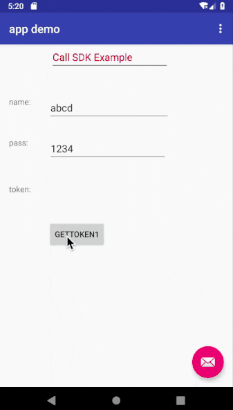

## mobile-sdk-demo

### 背景
1. 合作方公司包装 open-api 出现困难
2. 公司不希望直接暴露 open-api的 逻辑
3. 原生的 sdk 体验更好

### 效果图




### 流程(iOS)

1. APP实例化SDK, 使用 getTokenWithName 获取 token 
```
SDK *sdk = [SDK new];
    [sdk getTokenWithName:(_name.text) andPass:(_pass.text) andDelegate:(id<SDKDelegate>) self];
```
2. SDK 模拟请求，获取token
```
➜  mobile-sdk-demo git:(master) ✗ http https://util.online/sdk\?name\=1\&pass\=2
HTTP/1.1 200 OK
Content-Length: 57
Content-Type: application/json; charset=utf-8
Date: Tue, 28 May 2019 12:24:49 GMT
Etag: W/"39-/Py8Sx3C2MCm107jJY0+Btg0CAI"
Vary: Accept-Encoding
X-Powered-By: Express

{
    "date": "2019-05-28T12:24:49.705Z",
    "name": "1",
    "pass": "2"
}

➜  mobile-sdk-demo git:(master) ✗
```
3. 点击确认返回 date as token,
4. 点击取消返回 nil as token,


### 流程(android)
1. APP 实力话SDK
```
SdkActivity sdk = new SdkActivity();
                SdkCallBack sdkCallback = new SdkCallBack() {
                    @Override
                    public void tokenOnResult(final String token, final String name) {
                        Log.d(TAG, "tokenOnResult: token: " + token + " name : " + name);

                        uiHandler.post(new Runnable() {
                            @Override
                            public void run() {
                                TextView tokenText = findViewById(R.id.valueLabel);
                                tokenText.setText(token);
                            }
                        });
                    }
                };
                sdk.getToken(name, pass, MainActivity.this, sdkCallback);
```
2. SDK 模拟请求，获取token
3. 点击确认返回 date as token,
4. 点击取消返回 null as token,